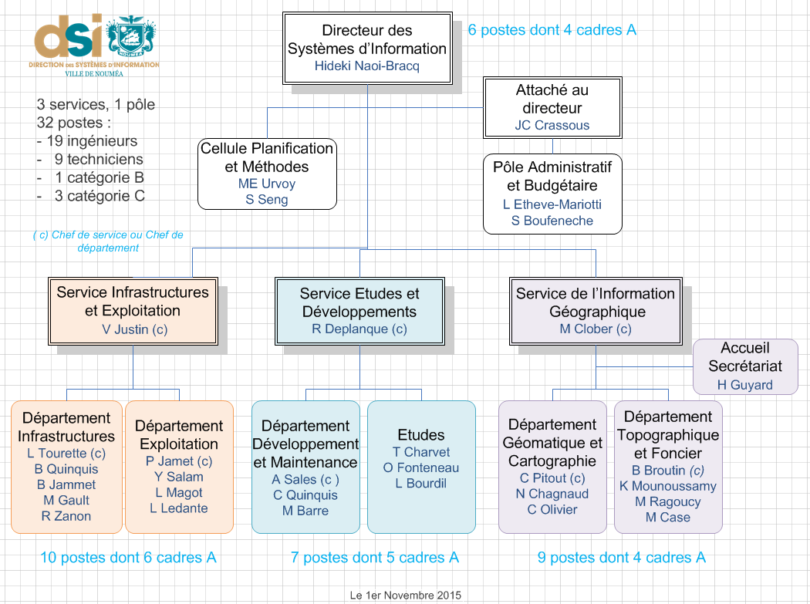
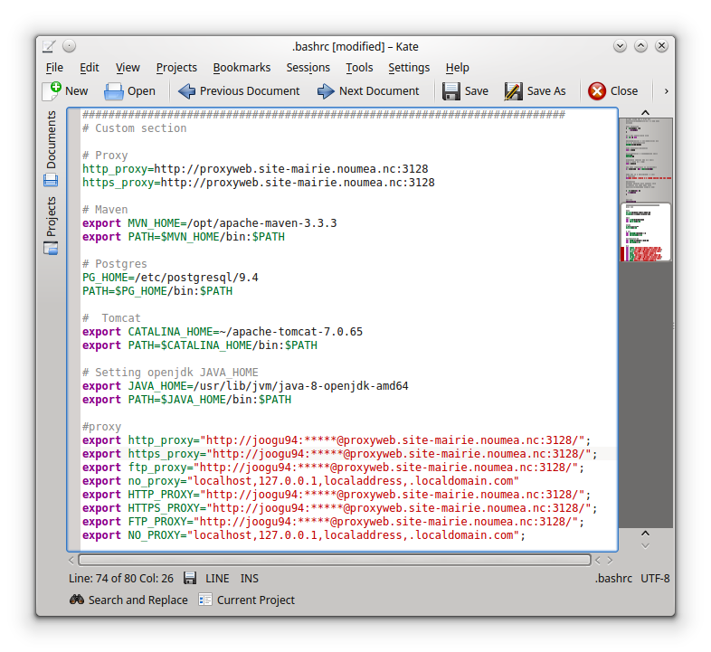
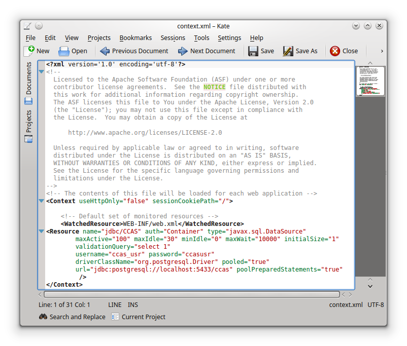
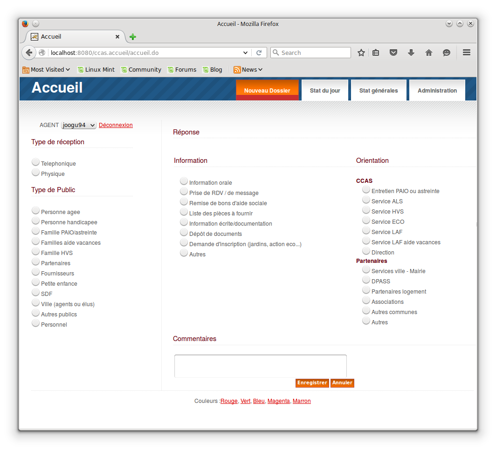

% Déploiement de l'application Accueil-CCAS
% Guillaume JOOP
% Stage du 28/10/2015 au 20/11/2015

# Remerciements

Je tiens à remercier en premier lieu toute l'équipe pédagogique de l'Université de
Nouvelle-Calédonie ainsi que les intervenants professionnels responsable de la formation
Science pour l'Ingénieur parcours Informatique pour avoir assuré sa partie théorique.

Je remercie également **Mr. Téodor KNAPIK** pour avoir accepté d’être mon tuteur universitaire.

Je tiens à remercier chaleureusement **Mr. Richard DEPLANQUE** pour m'avoir permis
d'effectuer mon stage au sein de son service et **Mr. Adrien SALES** pour
m'avoir accordé sa confiance en me confiant ce projet à réaliser en autonomie.

Je remercie les membres du Service Études et Développement qui ont travaillé en
collaboration avec moi, ainsi que l'ensemble du personnel de la DSI pour m'avoir
accueilli et aidé tout au long de mon stage, notamment **Mr. Hideki NAOI-BRACQ**, Directeur
des Systèmes d'Information de la Mairie de Nouméa.

# Introduction

Dans le cadre de **l'UE stage** du semestre 4 de la formation licence **Science pour
l'Ingénieur parcours Informatique**, j'ai effectué un stage de 4 semaines au sein de la
Direction des Services Informatique de la Mairie de Nouméa sous tutorat de Mr Adrien
SALES, chef du Département Maintenance et Développement, et de Mr Téodor KNAPIK, maître
de conférence en informatique à l'Université de Nouvelle-Calédonie.

Le SED étudie et assure la cohérence de l’évolution de l’ensemble du **système d’information**
en conformité avec l’architecture technique. Au début de mon stage, le SED
disposait d'une application dépendant de certains logiciels. L'objectif de mon stage
était donc de m'assurer que cette application puisse être exécuté avec les nouvelles
version des ces logiciels

Plus largement ce stage a été pour moi **l'opportunité** de découvrir le métier de
développeur et quelques aspects qui y sont reliés. J'ai pu apprendre à me servir des
outils Redmine, Subversion, Maven, PostgreSQL, Tomcat et git, le tout sous un environnement
Linux. J'ai ainsi pu approfondir mes connaissances en **SQL** et lignes de commandes Linux,
mais aussi découvrir de nouveaux langages comme le markdown **Pandoc** et le **LaTeX** d'ailleurs
utilisé pour rédiger ce rapport.

Au delà de mes connaissances, ce stage m'a aussi permis de mieux appréhender le monde
professionnel, le travail en **équipe** et par-dessus tout le travail en entreprise.

L’élaboration de ce rapport a pour principale source les différents enseignements tirés
de  la  pratique  journalière  de  la  tâche  à  laquelle j’étais affecté. En  vue  de
rendre  compte  de  manière  fidèle  et  réaliste  du  mois  passé  au  sein de la
Direction des Services Informatique de la **Mairie de Nouméa**,  il  apparait  logique  de
présenter  à  titre  préalable le  **cadre du  stage**  à  savoir ladite direction,  puis
le **contexte  du projet**  et  enfin  les  différentes **phases  de  réalisation** de celui-ci.

# Le cadre du stage

## Présentation générale de la DSI

La **Direction des Services Informatique** de la Mairie de Nouméa se comporte comme toutes
DSI. Sa mission telle qu'elle est présenté sur le portail interne est de :

>"Gérer et optimiser en permanence le système d’information de la
>Mairie et de ses établissements publics.
>
>Fixer et valider les grandes évolutions de l’informatique de la collectivité et
>anticiper les évolutions technologiques nécessaires.
>
>Évaluer et préconiser les investissements. Contrôler l’efficacité et la maîtrise des
>risques liés au système d’information."

La DSI respecte différentes norme comme la **N.E.I.G.E.** (surtout utilisé par le SIG), nomenclature
élaborée par différentes administrations locales, ainsi que la gouvernance **COBIT**

## Structure organisationelles et effectifs

Pour conduire ses mission la **DSI** est composée de 32 personnes (33 avec moi) et de 4
entités, parmi lesquels on retrouve :

* Un pole administratif
* 3 services liés à l'informatique :
     + le Service Etudes et Développements
     + le Service Infrastructures et Exploitation
     + le Service de l'Information Géographique

Le **SIG** possède son propre secrétariat étroitement lié au pole administratif de la DSI.
En effet, le SIG est annexé en dehors de l'hotel de ville, localisation principale de la
DSI

\pagebreak

## Présentation du service que j'ai intégré

Pour ma part j'ai intégré la DSI au **Service Etudes et Développements**.

>"Ce service étudie et assure la cohérence de l’évolution de l’ensemble du système
d’information en conformité avec l’architecture technique; il réalise la maîtrise
d’œuvre et assiste la maîtrise d’ouvrage pour la définition des besoins et des solutions
à installer; il développe des applicatifs, intègre les données Internet et administre le
portail d’entreprise."

Le SED est divisé en 2 départements : le **Département Etudes** et le **Département Maintenance et Développement**,
dirigé par Adrien SALES (mon maître de stage) et au sein duquel j'ai travaillé.

L'agencement du service fût réorganisé en 2015 sur le modèle de l'open-space, facilitant
ainsi la communication et l'échange pour l'ensemble de ses membres. L'équipe peut aussi
compter sur des outils tel que **Redmine** et **Subversion** afin de coordoner le travail
et les actions à effectuer.

La découverte de ces éléments dans le cadre de mon projet m'a été extremement bénéfique
en terme de connaissance techniques, organisationnelles, relationnelles et
professionnelles.

# Le contexte du projet

## Le contexte

Le **SED** s'occupe entre autres du développement et de la maintenance d'applications
destiné à la Mairie mais aussi à d'autres administrations travaillant en collaboration
avec la ville de Nouméa. C'est le cas notamment de l'application **Accueil-CCAS**, utilisé
par le **CCAS** pour gérer les demandes aux guichets et ainsi permettre de générer des
statistiques

Pour l'instant l'application dépend de logiciels et environnements, comme Tomcat et
Postgres mais aussi Java, et n'a pas été testé avec les dernières versions de ces derniers.

## Les objectifs et contraintes

Les objectifs du projets sont donc :

* Dans un premier temps de déployer l'application en local sur mon poste, sur lequel devra
etre installé :
     + **Postgres** pour la gestion de la base de données
     + **Subversion** pour récupérer la bonne version du code source de l'application
     + **Maven** pour la compilation de l'application
     + **Tomcat** pour accueillir l'application
     + **Open JDK** pour éxecuter l'application et le cas échéant modifier son code source
* Une fois la tache effectuer, rédiger le rapport ainsi que le slideshow dans un
langage dérivé de **markdown** et les convertir à l'aide de l'outil **pandoc** :
     + En **.pdf** et **.docx** pour le rapport
     + En **.html** utilisant le framework **reveal.js** pour le slideshow
* Le tout sera effectué sous un environnement **Linux** en privilégiant les lignes de
commandes à l'interface graphique

## Les outils du projet

Tout les outils utilisés dans le cadre du projet sont **open source**.

### Linux Mint

**Linux Mint** est une distribution Linux dérivé de **Ubuntu** et **Debian** dont le développement
commençat en 2006. Elle en est aujourd'hui à sa version 17.2 (nom de code **Rafaela** ) et
c'est aussi la version utilisé lors du stage.

Linux Mint utilise un environnement Gnome dans son édition principale. Cependant c'est
l'édition **KDE**, qui utilise donc un environnement KDE, qui à été choisi. Il s'agira bien
sur d'une version **64 bits** afin d'exploiter le plein potentiel des 4 Go de
mémoire vive embarquée dans le poste de travail fourni.

### Open JDK

**Open JDK** est la version open source de l'environnement de développement **Java** de la société
**Oracle**. Elle est officiellement soutenu par Oracle et en est donc à sa version 8, tout
comme la version officiel disponible sur le site de la société.

\pagebreak

### Redmine

**Redmine** est un client web de gestion de projet basé sur le framework **Ruby on Rails**.
Parmi ses nombreuses fonctionalitées on peut citer :

\ 

* Gestion multi-projets
* Gestion fine des droits utilisateurs définis par des **rôles**
* Gestion de groupes d'utilisateurs
* Rapports de bogues (bugs), demandes d'évolutions
* Personnalisation avancées des demandes (champs, flux, droits personnalisables)
* **Wiki** multi-projets
* Forums multi-projets
* News accessibles par **RSS / ATOM**
* Notifications par courriel (mail)
* Gestion de feuilles de route, **GANTT**, calendrier
* Saisie du temps passé (sans possibilité de modifier une saisie antérieure)
* **Historique**
* Identification possible via **LDAP, OpenID et CAS** 

Redmine utilise la syntaxe **Textile** pour ses pages wiki ainsi que nombres de champs
de saisie.

### Subversion

**Subversion** est un logiciel de **gestion de versions**, distribué sous licence **Apache** (depuis 2010) et donc
open source. Il fonctionnesur le mode client-serveur :

* Un serveur centralisé où se situent les fichiers constituant la **référence** (le "dépot")
* Des postes clients sur lesquels se trouvent les fichiers recopiés depuis le serveur
et éventuellement modifiés localement

### Maven

**Maven** est un outil de build Java.
Il est lui aussi sous licence Apache. Pour gérer la production, il obéit au schéma suivant :

* compile
* test
* package
* installe
* deploy
* ...

Pour chaque tâche les précédentes doivent avoir été éxécuté, sauf si elles ont déjà été
effectuées avec succés et qu'aucun changement n'a été fait dans le projet depuis. D'autres
tâches peuvent etre ajoutées comme clean, site (crée un site **wiki** ), etc...

### Tomcat

**Tomcat** est un **serveur HTTP** sous licence Apache (encore). Tout comme Maven, il est issu du
projet **Jakarta**. Tomcat à été écrit en Java et dispose donc de la portabilité
inhérente au langage. Tomcat en est aujourd'hui à sa version 8.0.28. Il a l'avantage
de disposer d'une **interface web** pour l'administration des applications déployées.

\pagebreak

### PotgreSQL

**PostgreSQL** est un **SGBD** sous licence **BSD**, un autre projet libre comme Apache ou
Linux. Dans sa distribution officiele, il ne dispose d'aucune interfacfe graphique et
tout doit donc se faire en ligne de commandes (il existe cependant quelques **GUI** comme
**pgAdmin** par exemple). La version 9.5 du logiciel vient d'entrer dans sa phase de **beta test**,
c'est donc la version 9.4 que nous utiliseront ici.

### Pandoc

**Pandoc** est un outil de **conversion de documents** s'appuyant sur une version modifié du
**Markdown** de John Gruber, un langage de **balisage léger**. Il permet de convertir ses
fichier en une grande variété de format allant du .pdf au .docx en passant par le .html
(Voir le [schéma complet](http://cache.preserve.io/rcwzwc0s/assets/3ec3be049db301203fc6338efbcb0ef4.png)
).

Pandoc est aussi capable d'interpréter du code **HTML** ou **LaTeX** meme si celui-ci est contenu
dans un fichier markdown. Il utilise d'ailleur le langage LaTeX pour la conversion en PDF.
Parmi les autres fonctions utiles de Pandoc se trouve la création automatique d'une **table des matières**.

### GitHub

GitHub est un service web d'hébergement et de gestion de développement de logiciels,
utilisant le logiciel de gestion de versions Git. Ce site est développé en partie en 
Ruby on Rails

### NetBeans

NetBeans est une interface de développement créé par Sun (aujourd'hui racheté par Oracle).
NetBeans permet de développer en une multitude de langage comme Java, C++, HTML et
beaucoup d'autres en lui incluant des greffons. Il est par exemple utilisé dans le cadre
du stage avec un greffon Markdown. Il gère la notion de projet et est compatible
avec des outils de versionning comme Subversion ou bien Git. Cela en fait un outil
polyvalent et trés pratique

# La réalisation du projet

## Installation du poste de travail

Dès mon premier jour au sein du **SED**, une unité centrale accompagné de périphériques et
d'un CD d'installation du systeme d'exploitation me fut présenté : j'allais m'occuper
de l'installation de mon poste de travail de A à Z. Les branchements et l'installation
de Linux Mint ne fut qu'une (longue) formalité. On m'a alors présenter à l'outil **Redmine**
d'où j'ai pu accéder à ma **feuille de route** ainsi qu'à un wiki m'expliquant la marche à
suivre afin d'installer correctement ma machine.

### Configuration de base

La première étapes fut **l'accés internet** : en effet, il faut indiquer au systeme que
l'on se situe derrière un **proxy** et quels identifiants utiliser. Linux oblige, aucune
interface graphique, tout se passe soit dans le **shell**, soit dans les fichiers systeme, soit
les deux !

Aprés avoir mis a jour le système, j'ai modifier un fichier **.bashrc** afin d'initialiser
certaines **variables** système comme les différents **PATH** d'applications (quue l'on précisera
une fois les dites applications installées).

\pagebreak 

### Installation de java/postrgreSQL/subversion/git

L'installation de ces programmes sous Linux n'a rien de compliqué, un simple

~~~~~
sudo apt-get install MonProgramme[version]
~~~~~

Et le tour est joué. Seulement voila, comme il me faut les toutes dernières versions,
elles ne sont pas systématiquement disponible dans le **dépot officiel** de la distribution.
Il faut donc ajouter un dépot pour pouvoir les installer. Je entre alors la ligne de commande

~~~~~
sudo -E add-apt-repository ppa:<user>/<ppa-name>
~~~~~

### Installation de maven

OpenJDK 1.8 et PostgreSQL 9.4 s'installent sans problème mais c'est un peu plus compliqué
pour maven. Il faut appeler les commandes suivantes :

~~~~~
export MVN_VERSION=3.3.1
wget http://mirror.lagoon.nc/pub/apache/maven/maven-3/3.2.5/binaries/apache-maven-${MVN_VERSION}-bin.tar.gz
ls -la apache-maven-${MVN_VERSION}-bin.tar.gz
sudo cp apache-maven-${MVN_VERSION}-bin.tar.gz /opt/
cd /opt
sudo tar xvzf apache-maven-${MVN_VERSION}-bin.tar.gz
sudo rm apache-maven-${MVN_VERSION}-bin.tar.gz
sudo rm -f maven
sudo ln -s apache-maven-${MVN_VERSION} maven
~~~~~

Maven est maintenant installé dans le dossier /opt de la machine. Cependant impossible
de l'utiliser, il ne peut pas se connecter à internet et donc récupérer les paquets.
Il faut donc créé le fichier **~/.m2.settings.xml** qui aura le contenu ci dessous :

~~~~~
<settings>
  <proxies>
    <proxy>
      <active>true</active>
      <protocol>http</protocol>
      <host>proxyweb.site-mairie.noumea.nc</host>
      <port>3128</port>
      <username>LOGIN</username>
      <password>XXXXXX</password>
      <nonProxyHosts>www.google.com|*.somewhere.com *dvlp*</nonProxyHosts>
    </proxy>
  </proxies>

  <servers>
    <server>
      <id>svn.ville-noumea.nc</id>
      <username>LOGIN</username>
      <password>XXXXXX</password>
    </server>
  </servers>
</settings>
~~~~~

### Installation de Tomcat

Ici rien de plus simple, je télécharge **l'archive** de la version voulu, ici Tomcat 7, et la
décompresse dans le dossier de mon choix, sans oublier d'aller préciser le chemin
dans le fichier .bashrc. Je veut maintenant que PostgreSQL et Tomcat **communique**, je copie
donc le **driver jdbc** correspondant dans le dossier **lib** de Tomcat.
Je met ensuite a jour le **contexte** et insère ceci au fichier **server.xml**

~~~~~
<Realm   className="org.apache.catalina.realm.JNDIRealm" 
        connectionURL="ldap://XXX.site-mairie.noumea.nc:389" 
        alternateURL="ldap://XXX.site-mairie.noumea.nc:389" 
        connectionName="XXX@site-mairie.noumea.nc" 
        connectionPassword="*****" 
        userBase="ou=Z-Users,dc=site-mairie,dc=noumea,dc=nc" 
        userSubtree="true" 
        userSearch="(sAMAccountName={0})" 
        roleBase="dc=site-mairie,dc=noumea,dc=nc" 
        roleName="name" 
        roleSubtree="true" 
        roleSearch="(member={0})" 
        referrals="follow" 
        />
~~~~~

\pagebreak

### Installation de NetBeans

Tout comme Tomcat, il suffit de télécharger l'archive de la version désiré et de
la décompresser ou on le souhaite. Mais comme Tomcat il va falloir également
changer quelques paramètres dans les fichiers. NetBeans ne se lancera pas s'il
ne trouve pas l'environnement java. En effet il est développé dans ce langage et
en a donc besoin pour se lancer. On lui indique alors le chemin d'installation de
java dans son fichier conf situé dans le dossier etc, à la ligne netbeans_jdkhome.
On peut maintenant le lancer correctement en lançant le shell correspondant.

## Déployer l'application

Maintenant que l'environnement de travail est installé et configuré, je vais pouvoir
**déployer** l'application et la **tester**

### Cloner la base de données en local

Pour commencer, il faut **cloner** la base de données utilisée par l'application.
Je procéde donc a un **pg_dump** de la base original situé sur un serveur, suivi d'un
**pg_restore** sur le serveur local (PostgreSQL). Voici les commandes utilisées

~~~~~
pg_dump --file  /tmp/accueilccas_dump.sql --clean --schema=ccas_adm --dbname=ccas --host=host.site-mairie.noumea.nc --username=ccas_read
su - postgres
psql ccas < /tmp/accueilccas_dump.sql
~~~~~

### Récupérer les sources et compiler

Une fois cette opération effectué, il faut récupérer l'application et la **compiler**.
J'utilise pour ça la partie **client** de Subversion afin de contacter le serveur sur
lequel sont situées les différentes version grace a un

~~~~~
svn checkout <adresse_serveur>
~~~~~

Je me place ensuite dans le répertoire où se trouve les **sources**, choisis la bonne version
(en l'occurence la 1.0) et éxecute les commandes **mvn package** et **mvn site** afin de créer
un site wiki de l'application, ainsi que le **.war**

### Déployer l'application sur le serveur Tomcat

Pour cela il suffit juste de déplacer le **.war** créé dans le répertoire **webapps** de tomcat
et l'application se déploie automatiquement. Cependant cette étapes m'a causé quelques
souci notamment due a l'accés à l'interface rendu impossible par l'utilisation du **realm**
custom et par un probleme de compatibilité du **domaine d'authentification** utilisé par
l'application avec **Tomcat 8** (donc ne venant pas de l'application elle meme).

Mais avant cela il faut bien sur s'assurer que le serveur est bien lancé en éxecutant
le fichier startup.sh situé dans le répertoire bin du dossier d'installation de Tomcat.

### Déployer les rapports BIRT

Pour la gestion des stats, l'application utilise **BirtViewer** qui doit donc etre déployer de la meme
façon que **Accueil-CCAS**, c'est a dire en plaçant le war dans **webapps**. Je copie alors
les rapports situé dans le répertoire **src/main/webapp/rapports** de Accueil-CCAS, les colles
dans le dossier **birt** et les test.

## Phase de test

L'application est maintenant **déployé** mais petit problème, impossible de se connecter
pour tester ses fonctions. C'est tout à fait normal

### La connexion

Pour tester la connexion à l'application, il a fallu ajouter une entrée avec mon
identifiant à la table **puser** de la base de donnée. En effet, l'application récupère
les identifiants dans cette table, fait le lien avec le **serveur d'authentification** pour
les mots de passe et vérifie que tout est correct pour accepter ou refuser la connexion
le cas échéant. J'utiliser les commandes suivantes :

~~~~~
su - postgres
psql -d ccas -U ccas_usr
insert into puser(login, css, admin, visible) values ('#mon_login', 'Blue', true, true);
~~~~~

\pagebreak

### Tester les fonctionalitées

Maintenant que l'on peut se connecter, il faut tester les différentes **fonctionalitées**
de l'application comme la saisie de dossier, l'affichage des **statistiques** de la journée
les statistiques générales et bien sur **l'administration**.

Lors des test, j'ai pu remarquer que les dates à rentrer pour l'affichage des rapport Birt
devait etre au **format US** (MM/DD/YYYY), chose qu'il faudrait préciser à l'utilisateur.

Autres probleme : l'option de changement de **thème** présente sur le site ne fonctionne
que pour la page en cours et revient a l'option stocker dans la BDD lors d'un
changement de page. Cela doit etre due à un probleme d'accés à la base de donnée
pour modification de la valeur correspondante. Cette modification n'est pour l'instant
possible qu'à partir de l'interface administrateur.

## Rédaction du rapport et de la présentation

### Dépot sur GitHub

Avant toute chose il me faut créer deux dépot sur GitHub : l'un pour le rapport
et l'autre pour la présentation. On travaillera maintenant en permanence avec
cet outil ainsi que NetBeans pour les récupérations, les modifications en local et les envois.

### Le rapport

Maintenant que l'application est testé, je peux passer à la deuxième
partie de mon rapport : sa **rédaction**. En effet la rédaction de ce rapport fait partie
intégrante du projet car elle est l'occasion de découvrir un **markdown** particulier
utilisé par Pandoc afin de comprendre les mécanismes utilisés lors de la **conversion**. Voici la commande entrée pour lancer cette dernière :

~~~~~
pandoc rapport.md -o rapport.pdf -V fontsize=12pt -V linestretch=1 -V linkcolor=black --number-sections --table-of-contents -V documentclass=scrreprt -V lang=french
~~~~~

* rapport.md est le fichier à convertir
* -o précise *l'output* (rapport.pdf ici)
* -V permet de préciser divers paramètres :
     + fontsize pour la taille de police (12pts comme demandé)
     + linestretch pour l'interligne simple
     + linkcolor précise la couleur des liens interne au documents
     + documentclass précise une classe pour la mise en page
     + lang permet de changer la langue du document, et donc d'afficher "Table des matières"
     au lieu de "Contents"
* -table-of-contents génère automatiquement une table des matières
* -number-section numérote toutes les sections et pas seulement les chapitres

### La présentation

Pour la présentation, la rédaction se fera toujours en **mardown** mais on utilisera un format
**HTML** utilisant le **framework** reveal.js. Celui-ci offre l'avantage d'etre ** *responsive* **
et donc d'etre lu depuis n'importe quel support disposant d'un interpréteur HTML.
La présentation n'est, à l'heure actuelle, toujours pas **finalisée** et sera présenté de
toute façon lors de la **soutenance**.

## Conclusion du projet

Ce projet s'est dans l'ensemble bien déroulés, malgré une tendance à **"l'improvisation"**
m'ayant valu quelques souci lors du déploiement de l'application. Même si tout les tache
qui m'ont été attrbué ont pu être effectué à **temps**, sa gestion fut quelque chose d'assez
délicat.

# Conclusion

Ce stage a été assez constructif et m'a permis de m'ouvrir à de nouveau concept et outils.

En effet, intégrer une grande structure m'a appris à plus compter sur le travail d'équipe
et à ne pas hésiter à demander de l'aide. J'ai pu découvrir de nombreux outils et me
perfectionner dans l'utilisation de beaucoup d'autre, Linux en tete. La découverte
de pandoc restera la plus marquante, de meme que reveal.js que je privilégierais à
l'avenir

Il m'a aussi appris a ne pas trop "bidouiller" et à suivre les instructions meme
en cas de pépin. En effet, cet aspect m'a valu quelques remarques de mon superviseur
afin de me recadrer. Je saurai faire de cet incident une expérience bénéfique
et en prendrai leçon pour l'avenir

De nature timide j'ai eu du mal à m'intégrer à l'équipe, mais je ne me suis à aucun
moment senti mis à l'écart et je suis convaincu qu'avec un peu plus de temps à leur
coté, je n'aurai eu aucun souci à créer un lien fort. Ce meme lien qui existe entre
les différents membres de l'équipe pouvait etre senti fortement, malgré une
communication rare due à l'utilisation de l'outil Redmine par lequel beaucoup
d'information transit.

# Références biliographiques

## Pour la documentation

* <http://fr.wikipedia.org>
* <http://pandoc.org/README.html>
* le wiki Redmine de la ville du SED
* <http://www.postgresql.org/docs/9.4/static/index.html>

## Pour la solution à de nombreuses question

* <http://stackoverflow.com/>
* <http://tex.stackexchange.com/>
* <https://openclassrooms.com/>
* <https://www.google.com/>

## Documents utilisés

* Organigramme de la DSI au 1er novembre 2015
* Exemples de rapports de stages fourni par l'université

# Glossaire

* N.E.I.G.E. : Nomenclature d'Echanges d'Information GEographqiue, déstiné à faciliter
la saisie, la fourniture et l'échange d'information géographique numériques dans le but
de constituer et d'actualiser une base de données
* COBIT : Control OBjectives for Information and related Technology ou en français
Objectifs de contrôle de l’Information et des Technologies Associées est un outil
fédérateur qui permet d'instaurer un langage commun pour parler de la gouvernance
des systèmes d'information tout en tentant d'intégrer d'autres référentiels tels que
ISO 9000, ITIL, etc.
* CCAS :
* Wiki : application web qui permet la création, la modification et
l'illustration collaboratives de pages à l'intérieur d'un site web
* Open source : logiciel dont le code source est en libre accés et redistribution
* SGBD : Système de Gestion de Base de Données
* Shell : Interface de ligne de commande des systèmes Unix
* Java EE : Java Entreprise Edition
* JDBC : Java DataBase Connectivity, interface permettant aux application Java d'accéder
à des source de données
* .war : Web application ARchive, un format particulier d'archive  dérivé du .jar contenant une
application web
